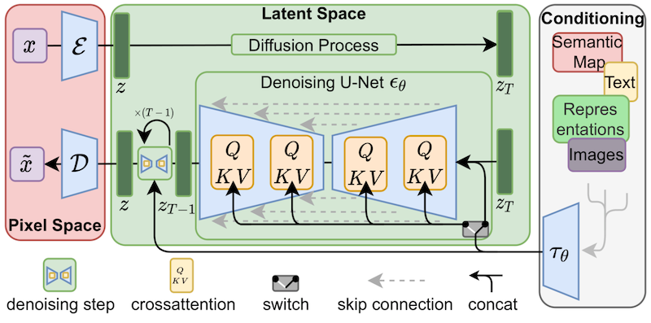
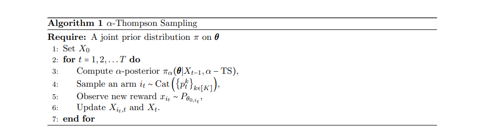

# Cross-Border Digital Marketer

**Integrated Framework for Cross-Border Digital Marketing Automation**  
*"Establish an AI-driven system that integrates [multimodal content generation](#multimodal-content-production-pipeline), [dynamic cross-platform allocation](#intelligent-allocation-optimization-system), and [ROI prediction](#roi-prediction-model-with-explainable-ai) to address **inefficiencies in multilingual creative production** and delayed strategy adaptation."*

[](https://python.org)
[](https://pytorch.org)
[](https://opensource.org/licenses/Apache-2.0)
[](https://arxiv.org/abs/1810.04805)
[](https://qwenlm.github.io/zh/blog/qwen3/)

<div align="center">
  
</div>

---

## Multimodal Content Production Pipeline​

### ​Cross-Language Creative Generation

**(1) ​​LLM-Based Copywriting​**​: Deploy a fine-tuned multilingual LLM (e.g., [Qwen3](https://huggingface.co/Qwen) with adapter modules for "Belt and Road" languages) to generate culturally adapted ad copies:

```python
  # Pseudo-code for multilingual copy generation  
  def generate_ad_copy(keywords, target_lang, cultural_context):  
      prompt = f"<your_prompt_template> on {target_lang}, {keywords} and {cultural_context}"  
      return llm_inference(prompt, adapter=target_lang)  
```
**"Belt and Road" Languages Corpora** for culturally adapted ad copy generation:
- [tbd] (alternative refer: [Scraper APIs - Bright Data (亮数据)](https://github.com/Cross-Border-E-Commerce-AI/Cross-Cultural-Merchandising-Expert) on E-commerce reviews)

**LLaMA-Factory for Easy and Efficient LLM Fine-tuning**: [https://github.com/hiyouga/LLaMA-Factory](https://github.com/hiyouga/LLaMA-Factory)

*“LLaMA Factory is an easy-to-use and efficient platform for training and fine-tuning large language models. With LLaMA Factory, you can fine-tune hundreds of pre-trained models locally without writing any code.”*

- The [dataset_info.json](https://github.com/hiyouga/LLaMA-Factory/blob/main/data/dataset_info.json) contains all available datasets. For custom dataset, **make sure** to add a dataset description in `dataset_info.json` and specify `dataset: dataset_name` before training to use it.

- The `llama3_lora_sft.yaml` provides a template configuration hyperparameters for training with LoRA. You can modify to fit your needs ([LLaMA-Factory/examples](https://github.com/hiyouga/LLaMA-Factory/tree/main/examples)).

- To run LoRA **fine-tuning**, **inference** and **merging** with LLaMA Factory, or simply use the `WebUI`:

```bash 
llamafactory-cli train/chat/export  <path_to_your_yaml_config_file> | llamafactory-cli webui
```

<table>
  <tr>
    <td></td>
    <td></td>
  </tr>
</table>

**(2) ​[Stable Diffusion](https://github.com/Stability-AI/stablediffusion) for Visual Synthesis​​**: Use regionalized [LoRA models fine-tuned](https://huggingface.co/blog/lora) on localized aesthetics (*e.g., Southeast Asian vs. Middle Eastern marketing preferences*).

- *Key Parameters*: **CLIP-guided** prompts with **regional semantic constraints** + **latent space interpolation** for style blending.

**Regional Aesthetic Corpora** on guided-prompts with semantic constraints for success marketing:
- [tbd] (alternative refer: [Scraper APIs - Bright Data (亮数据)](https://github.com/Cross-Border-E-Commerce-AI/Cross-Cultural-Merchandising-Expert) on E-commerce best-sells)

**Stability-AI/Stable_Diffusion** GitHub Repo: [https://github.com/Stability-AI/stablediffusion](https://github.com/Stability-AI/stablediffusion)

- Stable Diffusion 2 is a latent diffusion model conditioned on the penultimate text embeddings of a CLIP ViT-H/14 text encoder. 
- *Stable unCLIP 2.1* ([*Hugging Face*](https://huggingface.co/stabilityai/)) allows for image variations and mixing operations with modularity. ([*Hierarchical Text-Conditional Image Generation with CLIP Latents*](https://arxiv.org/abs/2204.06125)). Comes in two variants: [*Stable unCLIP-L*](https://huggingface.co/stabilityai/stable-diffusion-2-1-unclip/blob/main/sd21-unclip-l.ckpt) and [*Stable unCLIP-H*](https://huggingface.co/stabilityai/stable-diffusion-2-1-unclip/blob/main/sd21-unclip-h.ckpt), which are conditioned on **CLIP ViT-L** and **ViT-H** image embeddings, respectively. 
  - Detail instructions on [https://github.com/Stability-AI/stablediffusion/blob/main/doc/UNCLIP.MD](https://github.com/Stability-AI/stablediffusion/blob/main/doc/UNCLIP.MD)


**LoRA for Diffusers** HuggingFace Article: ["*Using LoRA for Efficient Stable Diffusion Fine-Tuning*"](https://huggingface.co/blog/lora)
-  In the case of Stable Diffusion fine-tuning, LoRA can be applied to the **cross-attention layers** that relate the image representations with the prompts that describe them. 
    - Easier to adopt optimization techniques such as [xFormers](https://github.com/facebookresearch/xformers) and [Prompt2Prompt](https://arxiv.org/abs/2208.01626) to access the layers.
    - Training is much faster with less VRAM requirements, and the **trained weights are much smaller**!
- [LoRA fine-tuning script](https://github.com/huggingface/diffusers/blob/main/examples/text_to_image/train_text_to_image_lora.py) helps to run in as low as `11-GB VRAM` **without** resorting to tricks such as *8-bit optimizers*.
- **Dreambooth models with LoRA** allows to "teach" new concepts to a SD model with only a few (5~10) images.
    -  Details implementation on [diffusers script](https://github.com/huggingface/diffusers/blob/main/examples/dreambooth/train_dreambooth_lora.py), the [README](https://github.com/huggingface/diffusers/tree/main/examples/dreambooth#training-with-low-rank-adaptation-of-large-language-models-lora), and [hyperparameter exploration blog post](https://huggingface.co/blog/dreambooth).
    - **LoRA-DreamBooth-Training-UI** quick start: [https://huggingface.co/spaces/lora-library/LoRA-DreamBooth-Training-UI](https://huggingface.co/spaces/lora-library/LoRA-DreamBooth-Training-UI)



### Quality Control via Multimodal Alignment

**(1) ​Cross-Modal Consistency Check**: Align generated text and visuals using **CLIP-score metrics** to ensure **semantic coherence**.
- **CLIP (Contrastive Language-Image Pretraining)**: a pre-trained vision-language model that maps both text and images into a *unified semantic embedding space*.
- The **CLIP Score** is a pivotal metric for assessing the **alignment between images and text prompts**, focusing on *semantic coherence rather than aesthetic quality*. 
- **Alternative evaluation metrics**: [*T2IScore* (arXiv:2404.04251)](https://arxiv.org/abs/2404.04251) and [*VIEScore* (arXiv:2312.14867v1)](https://arxiv.org/html/2312.14867v1)


[*"CLIPScore:A Reference-free Evaluation Metric for Image Captioning"* arXiv:2104.08718 [cs.CV]](https://arxiv.org/abs/2104.08718)

$$\text{CLIP-S}(\mathbf{c},\mathbf{v})=w*\max (\cos (\mathbf{c},\mathbf{v}),0)$$

$$\text{RefCLIP-S}(\mathbf{c}, \mathbf{R}, \mathbf{v}) = \text{H-Mean}(\text{CLIP-S}(\mathbf{c}, \mathbf{v}), \max_{r \in \mathbf{R}}(\max \cos(\mathbf{c}, \mathbf{r}), 0))$$

<table>
  <tr>
    <td></td>
    <td></td>
  </tr>
</table>

```python
  # Pseudo-code for CLIP score calculation  
  def calculate_clip_score(text, image):  
      text_features = clip_model.encode_text(clip.tokenize([text]))  
      image_features = clip_model.encode_image(image)  
      return cosine_similarity(text_features, image_features)  
```

*HuggingFace: Evaluating Diffusion Models*: [https://huggingface.co/docs/diffusers/conceptual/evaluation](https://huggingface.co/docs/diffusers/v0.33.1/conceptual/evaluation)

**(2) ​​A/B Testing Interface**: Deploy **human-in-the-loop validation** for high-cost campaigns (*e.g., geopolitical-sensitive content*).
- A/B testing is a method where two software variants are compared by evaluating the merit of the variants through exposure to the end-users of the system.
(["*A/B testing: A systematic literature review*"](https://doi.org/10.1016/j.jss.2024.112011))


```python
  # Pseudo-code for A/B testing interface  
  def ab_test(campaign_id, ad_variants):  
      results = []  
      for variant in ad_variants:  
          result = run_ab_test(campaign_id, variant)  
          results.append(result)  
      return analyze_results(results)  
```

---

## Intelligent Allocation Optimization System​

### Genetic Algorithm (GA) Optimization:
In computer science, [**genetic algorithms**](https://en.wikipedia.org/wiki/Genetic_algorithm) are commonly used to generate high-quality solutions to *optimization and search problems* via biologically inspired operators such as *selection, crossover, and mutation*.
- *Genes*: Ad elements (headline, image style, CTA color).
- *Fitness Function*: Weighted sum of CTR (40%), CVR (30%), and ROAS (30%).
- *Crossover/Mutation*: Use SBX (Simulated Binary Crossover) for continuous variables (e.g., color hues) and uniform mutation for discrete elements.


```python
  # Pseudo-code for GA-based ad optimization  
  population = initialize_population(ad_elements)  
  for generation in generations:  
      fitness = evaluate(population, metrics=[CTR, CVR, ROAS])  
      parents = tournament_selection(fitness)  
      offspring = crossover(parents) + mutation(parents)  
      population = survivors_selection(parents + offspring)  
```

### Bayesian Multi-Armed Bandit (MAB)​​ for Real-Time Traffic Allocation​​
*"Adapts to sudden platform policy changes (e.g., TikTok algorithm updates) 2.3x faster than Q-learning baselines."*

The [**multi-armed bandit (MAB)**](https://en.wikipedia.org/wiki/Multi-armed_bandit) can be asserted as a set of real distributioins $B=\{{R_1,...,R_K}\}$ where each distribution being associated with the rewards delivered by one of the $K \in \mathbb {N} ^{+}$ levers. Let $\mu_1,...,\mu_K$ be the mean values associated with these reward distributions. The goal of the MAB problem is to maximize the expected reward over a finite time horizon $T$ by selecting one arm at each time step $t \in \{{1,...,T}\}$.

The regret $\rho$ after $T$ rounds is defined as the expected difference between the reward sum associated with an optimal strategy and the sum of the collected rewards:

$$\rho = T\mu^* - \sum_{t=1}^{T} \hat{r}_t,$$

where $\mu^{*}$ is the maximal reward mean, $\mu^{*} = \max_{k}\{\mu_k\}$, and $\hat{r}_t$ is the reward in round t.

**(1) Arms: Ad creatives clustered by similarity (CLIP embeddings + topic modeling)**

- [*"A Visual Structural Topic Model with Pretrained Image Embeddings"* (arXiv:2504.10004 [cs.CV])](https://arxiv.org/abs/2504.10004)

- Given the dataset consists of $N$ images, with each represented by an embedding vector $\mathbf{z}_{i} \in \mathbb{R}^D$, and the covariates $\mathbf{x}_i \in \mathbb{R}^P$ influence the prevalence of visual topics. Model each image embedding $\mathbf{z}_{i}$ as normally distributed and generated by a mixture of $K$ topics:
$$\mathbf{z}_{i} \sim \mathcal{N}(\sum_{k=1}^{K} \theta_{i,k} \mathbf{\beta}_{k}, \Sigma_{k}),$$
- where $\theta_{i,k}$ is the topic proportion for image $i$ and $\mathbf{\beta}_{k}$ is the mean vector of topic $k$. The covariance matrix $\Sigma_{k}$ captures the within-topic variance.


**(2) Reward: Thompson sampling with Beta posterior updating based on hourly CTR/CVR**

- [*"Generalized Regret Analysis of Thompson Sampling using
Fractional Posteriors"* (	arXiv:2309.06349 [stat.ML])](https://arxiv.org/abs/2309.06349)
- $\alpha$-TS is a variant of Thompson Sampling that uses a *fractional posterior distribution* to sample from the action space. The algorithm is designed to balance exploration and exploitation in a more efficient manner than traditional Thompson Sampling methods.
- the instance-dependent $\mathcal{O} (\sum_{k \neq i} * \Delta_k (\frac{log(T)}{C(\alpha)\Delta_k^2} + \frac{1}{2}))$ and instance-independent $\mathcal{O}(\sqrt{KT\log{K}})$ frequentist regret bounds under very mild conditions on the prior and reward distributions, where $\Delta_k$ is the gap between the true mean rewards of the $k^{th}$ and the best arms, and $C(\alpha)$ is a known constant.


### Validation Protocol​​
1. **Offline Simulation**​​: Replay historical logs to compare GA + MAB against rule-based allocation.
2. **Online Metrics​**​: Monitor convergence speed (time to 95% optimal allocation) and regret minimization.

---

## ​​ROI Prediction Model with Explainable AI​


---

## System Integration & Performance Benchmarks​


---

## 🤝 How to Contribute
We welcome cultural spies, code wizards, and emoji translators! **3 ways to join the mission:**
1. **Add Cultural Lexicons** 📖: Teach our AI your local slang
2. **Train Trend Detectors** 🔮: Help predict the next big thing
3. **Fix Cultural Faux Pas** 🚫: Save companies from accidental taboos


We're on scheduale ... 


## 📜 License
Apache 2.0 - Use freely, but we take no responsibility if:

1. Our AI declares pineapples illegal in Hawaii 🍍👮♂️
2. Your products become too popular for your warehouse to handle 📦💥

---

**Made with ❤️ by Global Market Wizards​​**

*Because in the game of global commerce, you either win or... accidentally offend 1 billion people.*